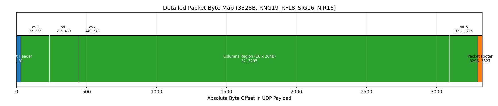
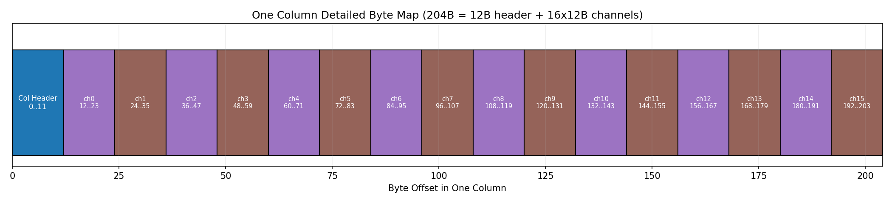
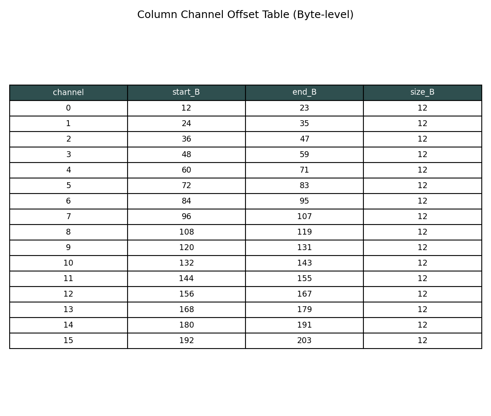
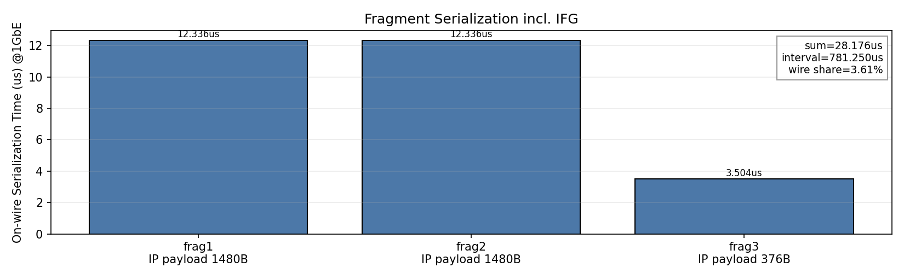

# lidar-tas260226

LAN9662 + Ouster LiDAR에서 `cycle=781us` TAS를 실측한 레포.

## GitHub Quick View

현재 센서 기준(실측):
- sensor: `OS1-16`
- profile: `RNG19_RFL8_SIG16_NIR16`
- lidar UDP payload: `3328B`
- packet interval: `781.25us` (`2048x10` 또는 `1024x20`, `columns_per_packet=16`)
- MTU1500 fragment(IP payload): `[1480, 1480, 376]`
- fragment on-wire time 합(1GbE, IFG 포함): `28.176us`

핵심 그림:
- Packet absolute byte map  
  
- One-column byte map  
  
- Channel offset table  
  
- Fragment/IFG timing  
  

빠른 실행:
```bash
cd /home/kim/lidar-tas260226
python3 scripts/generate_packet_layout_detailed.py --host 192.168.6.11 --mtu 1500
```

모드 지정 후 다시 그리기:
```bash
cd /home/kim/lidar-tas260226
python3 scripts/generate_packet_layout_detailed.py \
  --host 192.168.6.11 \
  --set-mode 2048x10 \
  --mtu 1500
```

해석 한 줄:
- `781us`는 패킷과 패킷 사이 간격이고, `28.176us`는 분할된 1개 패킷이 선로를 점유하는 시간(직렬화+IFG)이다.

## 결론 (핵심)

- 질문: `TAS open 28us`를 딱 맞출 수 있나?
- 답: **이론적으로는 가능해 보이지만, 현재 구성에서는 안정 운용 불가**.

이유:
- 1GbE에서 3328B LiDAR UDP 1개 직렬화 시간은 대략 `26.9us`.
- 하지만 현재 경로(MTU 1500)에서는 이 UDP가 **IP fragment 3개**로 전송됨.
- 따라서 실제로는 약 `26.9us x 3 = 80.8us` + 가드가 필요.
- 또, LiDAR 송신 시작 위상과 TAS gate 시작 위상이 계속 어긋나면 결과가 급변.

즉, `28us`는 "딱 맞춰 쓰는 운영값"으로는 현실적으로 매우 불안정함.

## 시작위상(라이다 시작점) 관련 결론

- 질문: "라이다 시작지점을 못 정하는 거 아님?"
- 답: **맞음. 현재 구성에선 완전 고정하기 어려움.**

정확히는:
- PTP 없으면: 시간축이 달라서 위상 유지 거의 불가.
- PTP 있어도: LiDAR 패킷 배출 위상을 사용자가 0ns로 완전히 고정 제어하기 어렵고, 드리프트/재초기화 영향이 남음.
- 그래서 실무는 "정렬(phase sweep)로 최적 위상 찾기 + open 여유 확보" 방식으로 운영.

## 이번 실험 결과 (2026-02-26)

기준:
- `cycle = 781us`
- `base-time = switch-future` (스위치 current-time 기준)
- phase sweep 후 best phase로 open sweep 수행

요약 결과:
- best phase: `0 ns`
- best phase 성능(open=120us): `96.19%` (100% 아님)
- open sweep에서 `>=99.9%` 최소 open: `148us`
- `144us`: `90.37%`
- `140us`: `0%`
- `28us`: `0%`
- `0us`(완전 차단): `0%`

원본:
- `data/alignment_summary_20260226_103136.md`
- `data/phase_sweep_20260226_103136.json`
- `data/open_sweep_best_phase_20260226_103136.json`

추가 검증 (`30us` 집중, 2026-02-26):
- `data/phase_sweep_open30_20260226_104646.json`
- `data/open40to20_phase500k_20260226_105015.json`
- `data/open30_phase0_20260226_105122.json`
- `data/open30_phase380000_20260226_105126.json`
- `data/open30_phase500000_20260226_105130.json`
- `data/open30_phase620000_20260226_105134.json`
- `data/open30_phase740000_20260226_105138.json`

요약:
- `open=30us`는 일부 phase에서만 수신되고 대부분 phase는 `0%`.
- 같은 phase처럼 보여도 재실행 시 결과가 쉽게 바뀜.
- 따라서 `30us`는 운영 안정값으로 부적합.

## 권장 운영값

- 장시간(25초 x 3회, phase=0ns) 기준 최소 안정값은 `146us`로 측정됨.
- 실운영 권장은 마진 포함 `150us` 이상.
- 최소화 실험은 `150 -> 148 -> 146 -> 144`처럼 경계 근처를 촘촘히 검증.
- `28us`는 실험값으로는 의미가 있어도 운영 목표값으로는 비권장.

장시간 최적화 결과:
- `data/single_lidar_long_opt_20260226_110713.json`
- `data/single_lidar_long_opt_20260226_110713.md`


추가 경계 실험 (phase 전체 스윕, 2026-02-26):
- `data/phase_sweep_open144_20260226_112449.json`
- `data/phase_sweep_open146_20260226_112727.json`
- `data/phase_sweep_open148_20260226_113004.json`
- `data/phase_sweep_open150_20260226_113241.json`
- 요약: `data/phase_sweep_boundary_20260226.md`

경계 결론:
- `144us`: phase 민감(0~97.96%, 99.9% 통과 0/40)
- `146us`: phase 강건(99.95~100%, 99.9% 통과 40/40)
- 따라서 최소 안정 경계는 `146us`, 운영 권장은 `150us`.


추가 실험 (웹서버 실행 상태 매트릭스):
- `data/server_stats_matrix_20260226_125107.json` (2048x10, phase_lock off/on)
- `data/server_stats_matrix_20260226_125855.json` (1024x10, phase_lock off/on)
- 요약: `data/extra_experiments_20260226.md`

핵심:
- `phase_lock_enable=true`만으로 144us 경계 문제는 해결되지 않음
- `lidar_mode=1024x10` 변경만으로도 경계 안정화되지 않음
- 현재 구성에서 안정 경계는 여전히 146us 이상

추가 실험 (3-slot 분할, 웹서버 API 기반, 2026-02-26):
- `data/three_slot_server_matrix_20260226_131000.json`
- `data/three_slot_server_matrix_20260226_131000.md`
- `data/three_slot_30_recheck_20260226_132545.json`

핵심:
- 3-slot(`open-close-open`)로 나눠도 안정성이 자동으로 좋아지지 않음.
- `781/150` 계열 3분할(예: `75/631/75`, `30/631/120`)은 단일 150 대비 개선 근거가 없음.
- `781/30` 계열 3분할은 오히려 큰 드롭 케이스가 반복됨.
- 재검증에서 `single_30`도 FAIL로 확인되어, `30us` 운용값 가설은 재현성 부족.
- 결론: 단일 LiDAR 안정 운용은 계속 `open >= 146us`(권장 `150us`)가 맞음.

추가 실험 (50us + phase alignment, 2026-02-26):
- `data/phase_align_50us_20260226_133151.json`
- `data/phase_align_50us_20260226_133151.md`

핵심:
- 단일 `open=50us`는 phase 민감도가 매우 커서 안정 불가.
  - phase_lock off: pass(>=99.9%) `2/20`
  - phase_lock on: pass(>=99.9%) `0/20`
- 3-slot으로 50us를 분할하면 case에 따라 개선됨.
  - `10/731/40`:
    - phase_lock off: pass `17/20`, `fc_min=99.50%`
    - phase_lock on: pass `14/20`, `fc_min=98.89%`
  - `25/731/25`: 중간 수준(pass `9~11/20`)
  - `40/731/10`: 특정 위상 구간에서만 pass(대역 이탈 시 급락)
- 결론:
  - "50 정도면 된다"는 가설은 **단일 50us 기준으론 성립 안 함**.
  - 다만 **3-slot + 위상 정렬 유지가 가능할 때만** 일부 패턴(`10/731/40`)은 실사용 가능성이 있음.
  - 위상 유지 실패 시 급락하므로, 운영 안정 최우선이면 여전히 `146~150us`가 안전.

추가 실험 (781.25us 정밀 + open 폭 확대, 2026-02-26):
- `data/phase_align_781p25_20260226_135910.json`
- `data/phase_align_781p25_20260226_135910.md`
- `data/refine_781p25_open_20260226_143346.json`
- `data/refine_781p25_open_20260226_143346.md`
- `data/soak_781p25_order_compare_20260226_143637.json`
- `data/soak_781p25_order_compare_20260226_143637.md`
- `data/allopen_vs_smallopen_20260226_151542.json`
- `data/allopen_vs_smallopen_20260226_151542.md`
- `data/fine_front_compare_20260226_161307.json`
- `data/fine_front_compare_20260226_161307.md`

핵심:
- 질문처럼 open을 더 넓히면 안정성은 실제로 개선됨.
- `cycle=781.25us`에서 최고 강건 설정(이번 매트릭스 기준):
  - `split_150us = 75us(open) / 631.25us(close) / 75us(open)`
  - `phase_lock=false`
  - PASS(>=99.9% & fps>=9.5) `16/20`, `fc_min=99.59%`, `fc_mean=99.95%`
- 50~120us 구간은 일부 phase에서 잘 되지만, phase 전구간 강건성은 150us보다 낮음.
- 즉, 실운영 안정 우선이면 `open=150us` 계열이 가장 안전.
- 장시간(15분 x 2) 순서 비교 결과:
  - `open-close-open (75/631.25/75)`:
    - `fc_mean=99.716`, `fc_p01=96.438`, `fc_p05=98.420`, `fc_min=94.567`
  - `close-open-close (315.625/150/315.625)`:
    - `fc_mean=99.715`, `fc_p01=96.719`, `fc_p05=98.488`, `fc_min=94.464`
  - 평균은 거의 동일하지만, 하위 퍼센타일(`p01/p05`)은 `close-open-close`가 근소 우위.
  - 따라서 현재 운영 추천값은 `close-open-close`로 갱신.

현재 적용 운영값(2026-02-26):
- cycle: `781.25us` (`781250ns`)
- entries: `close 305.625us / open 150us / close 325.625us`
- phase offset: `180000ns` (base-time = switch current-time + offset + phase)
- phase_lock: `false`
- switch fetch 기준 `config-pending: false` 확인

추가 검증 (\"큐 안쌓이면 all-open과 같아지는가\", 2026-02-26):
- 방법: all-open baseline을 먼저 120s 측정 후,
  `close-open-close`에서 `open=30/40/50us` 각각에 대해
  `close_front_ratio + phase`를 탐색해 최적점을 찾아 120s soak 비교.
- 스크립트: `scripts/run_small_open_vs_allopen.py`

요약:
- all-open: `fc_mean=99.926`, `fps_mean=9.870`
- best 30us: `ratio=0.20`, `phase=0ns` -> `fc_mean=90.389`, `fps_mean=4.889`
- best 40us: `ratio=0.20`, `phase=651040ns` -> `fc_mean=93.843`, `fps_mean=5.773`
- best 50us: `ratio=0.50`, `phase=390624ns` -> `fc_mean=97.274`, `fps_mean=6.117`

결론:
- close 앞/뒤 조절은 분명 효과가 있음(최적 ratio/phase가 존재).
- 하지만 현재 단일 LiDAR 경로에선 `open<=50us`가 all-open 동등 수준까지 올라오지 못함.
- 즉 \"큐 안쌓이게\"를 목표로 all-open과 동등하게 만들려면 open을 더 크게 잡아야 함.

추가 검증 (비율 대신 절대 ns 미세조정, 2026-02-26):
- 요구사항 반영: ratio 스윕이 아니라 `close_front_ns` 절대값을 직접 조정.
- 조건: `cycle=781250ns`, `open=150000ns`, `phase=0ns`, `phase_lock=false`
- 비교값:
  - `front=305625ns` / `back=325625ns`
  - `front=315625ns` / `back=315625ns`
  - `front=325625ns` / `back=305625ns`

결과(120초씩):
- all-open: `fc_mean=99.750`, `fc_p01=97.077`, `fps_mean=9.860`
- front 305625: `fc_mean=99.784`, `fc_p01=97.598`, `fps_mean=10.002`  ← best
- front 315625: `fc_mean=99.715`, `fc_p01=95.818`, `fps_mean=10.001`
- front 325625: `fc_mean=99.726`, `fc_p01=96.466`, `fps_mean=10.003`

해석:
- 같은 `open=150us`라도 `close front/back`를 ns 단위로 조정하면 하위 퍼센타일이 달라짐.
- 즉, \"시작점 + 앞뒤 close\" 미세정렬이 실제로 의미 있음.
- 당시(120s 단기) 단일 LiDAR 운영 최적값은 `305625 / 150000 / 325625`로 갱신.

추가 검증 (절대 ns + phase 장시간 deep-opt, 2026-02-26):
- 파일:
  - `data/deep_opt_150ns_20260226_170215.json`
  - `data/deep_opt_150ns_20260226_170215.md`
- 방법:
  - coarse: `front={295625,300625,305625,310625,315625}` x `phase=0..781250 step 20000`
  - top3 후보 선별 후 장시간 soak `600s`씩 비교 (`all_open` + 후보 3개)
- 결과(요약):
  - `all_open`: `fc_p01=96.527`, `fc_mean=99.713`
  - `cand1 (front=305625, phase=220000)`: `fc_p01=96.719`, `fc_mean=99.692`
  - `cand2 (front=305625, phase=200000)`: `fc_p01=96.812`, `fc_mean=99.706`
  - `cand3 (front=305625, phase=180000)`: `fc_p01=97.187`, `fc_mean=99.731`  ← best
- delta(best - all_open):
  - `fc_mean +0.018`
  - `fc_p01 +0.661`
  - `fps_mean ~0` (거의 동일)

결론:
- 비율이 아니라 절대 `ns`와 `phase`를 같이 미세조정하면 하위 퍼센타일 안정성이 실제로 개선됨.
- 장시간 기준 현재 best는 `close/open/close = 305625 / 150000 / 325625` + `phase=180000ns`.
- 재현 스크립트: `scripts/run_deep_opt_150ns.py`

추가 검증 (timestamp_mode + phase_lock + TAS phase 매트릭스, 2026-02-27):
- 목적:
  - "데이터 시작위상"이 실제로 도움이 되는지, `timestamp_mode/phase_lock` 축을 분리해 확인
- 파일:
  - `data/phaselock_tas_2d_20260227_113235.json`
  - `data/phaselock_tas_2d_20260227_113235.md`
  - `data/timebase_mode_matrix_20260227_114513.json`
  - `data/timebase_mode_matrix_20260227_114513.md`
  - `data/timebase_mode_matrix_20260227_115526.json`
  - `data/timebase_mode_matrix_20260227_115526.md`
- 스크립트:
  - `scripts/run_phase_lock_tas_2d.py`
  - `scripts/run_timebase_mode_matrix.py`

핵심 결과(`timebase_mode_matrix_20260227_115526`, 60s/case):
- 1위: `TIME_FROM_PTP_1588 + phase_lock=true + offset=0 + tas_phase=300000`
  - `fc_mean=99.298`, `fc_p01=96.274`, `fps_mean=9.725`
- 2위: `TIME_FROM_PTP_1588 + phase_lock=false + tas_phase=180000`
  - `fc_mean=99.531`, `fc_p01=95.159`
- 3위 이하:
  - `offset=90000`는 오히려 악화(`fc_p01=89.422`)
  - `TIME_FROM_SYNC_PULSE_IN + phase_lock=true`는 심각한 붕괴 가능성 확인

해석:
- "각도 자체"보다 "시간축 오차를 줄이는 위상 정렬"이 실제로 중요함.
- 단, phase_lock은 offset 선택이 잘못되면 성능이 크게 악화됨.
- 현재 장비에서는 `offset=0`이 가장 안전하고, `offset=90000`은 비권장.

추가 검증 (큐 간접 추정: 경계 이하 open에서 time-to-drop 역산, 2026-02-27):
- 파일:
  - `data/queue_infer_20260227_125740.json`
  - `data/queue_infer_20260227_125740.md`
  - `data/queue_infer_20260227_130529.json`
  - `data/queue_infer_20260227_130529.md`
- 스크립트:
  - `scripts/run_queue_infer_tests.py`
- 방법:
  - 안정 기준 `open=146us`를 reference로 두고,
  - `145.5/145.0/144.5us` 등 경계 이하에서 `t_drop`(연속 fail 발생 시점)을 측정
  - 부족 서비스율(`deficit_Bps`)과 `t_drop`를 곱해 backlog 규모를 역산
- 결과(재측정 `queue_infer_20260227_130529`):
  - `145.5us`: 70초 내 미붕괴(`t_drop=None`) 2/2
  - `145.0us`: `t_drop≈10.9s` (2/2)
  - `144.5us`: `t_drop≈10.86s` (2/2)
  - 역산 backlog 범위: 약 `1.75MB ~ 2.61MB` (중앙값 약 `2.18MB`)

해석:
- 본 값은 **스위치 내부 큐 절대용량**이 아니라,
  "현재 경로/위상 조건에서 붕괴가 시작되는 누적 backlog 규모"의 간접 추정치임.
- 즉 큐 메모리 단독값이라기보다, 큐 + 도착버스트 + 위상 오차가 합쳐진 유효 backlog 한계로 해석하는 것이 타당함.

추가 검증 (메인보드 NIC + PTP master 정밀 스윕, 2026-02-27):
- 배선 변경:
  - LiDAR 경로를 `enp4s0`(HW timestamp 지원)로 이동
  - 인터넷은 별도 USB NIC(`enx00e04c6812d1`)로 분리
- PTP:
  - `ptp4l -i enp4s0 -m`로 host를 grandmaster로 운용 후 센서를 `TIME_FROM_PTP_1588`로 실험
- 파일:
  - `data/phaselock_tas_2d_20260227_135257.json`
  - `data/phaselock_tas_2d_20260227_135257.md`
  - `data/ptp_master_soak_compare_20260227_141403.json`
  - `data/ptp_master_soak_compare_20260227_141403.md`

요약:
- 2D 단기 스윕(1s 샘플) best:
  - `timestamp_mode=TIME_FROM_PTP_1588`
  - `phase_lock=true`, `phase_lock_offset=60000`
  - `tas_phase=520000ns`
  - `fc_mean=99.443`, `fc_p01=99.025`
- 장시간 soak(120s) 비교에서는 단기 best가 유지되지 않음:
  - `ptp + phase_lock on (off60k, phase520k)`: `fc_p01=90.723`
  - `ptp + phase_lock off (phase180k)`: `fc_p01=90.599`
  - `sync_in + phase_lock off (phase180k)`: `fc_p01=91.061`  ← best

해석:
- PTP 환경에서도 "단기 최고점 = 장기 안정점"이 아님.
- 이번 조건에서는 여전히 `SYNC_PULSE_IN + phase_lock off + phase180k`가 장기 기준 최선.
- 따라서 운영값은 기존 `305625/150000/325625 @ phase180k`를 유지.

추가 검증 (PTP 상태에서 all-open vs TAS 프로파일 최종 비교, 2026-02-27):
- 파일:
  - `data/ptp_final_compare_20260227_152849.json`
  - `data/ptp_final_compare_20260227_152849.md`
- 조건:
  - `ptp4l(phc0) + phc2sys` 동작, 센서 `timestamp_mode=TIME_FROM_PTP_1588`
  - 커널 UDP 수신 버퍼 상향:
    - `net.core.rmem_max=33554432`
    - `net.core.rmem_default=8388608`
    - `net.core.netdev_max_backlog=5000`
- 결과(90s/case):
  - `ptp_allopen`: `fc_mean=99.999`, `fc_p01=99.900`, `fps_mean=9.814`, `udp_err_delta=0`
  - `ptp_plock_on_phase340k`: `fc_mean=99.947`, `fc_p01=94.746`, `udp_err_delta=0`
  - `ptp_plock_off_phase180k`: `fc_mean=99.870`, `fc_p01=87.227`, `udp_err_delta=0`
  - best: `ptp_allopen`

해석:
- "패킷 이상"으로 보이던 증상은 주로 수신 버퍼/스케줄 영향으로 확인됨.
- PTP에서 tail 안정성 기준으로는 현재 `all-open`이 가장 안정적임.
- 즉, 단기 스윕에서 얻은 TAS 위상 최적점은 장기 tail 기준으로 유지되지 않을 수 있음.

## 라이다 시작점(위치) 어떻게 맞췄는가

정확히는 \"LiDAR 시작점을 직접 고정\"한 게 아니라, 아래 방식으로 **상대 위상 정렬**을 수행:

1. 스위치 `current-time`를 매번 fetch
2. `admin-base-time = current-time + offset + phase_offset`로 TAS 시작 시점 생성
3. `phase_offset`을 0 ~ cycle 전구간 sweep
4. 각 phase에서 `frame_completeness + fps`를 측정해 통과/실패 맵 생성
5. 통과 영역이 가장 넓은 설정(open/entry split)을 선택

중요:
- LiDAR의 packet emission epoch를 절대 0ns로 \"고정 제어\"한 것이 아님.
- 그래서 운영에서는 \"한 점 최적\"보다 \"위상 오차를 견디는 폭(robust window)\"이 핵심.
- 이번 기준에서 그 robust window가 가장 큰 값이 `split 150us`였다.

## 멀티 LiDAR 전략 (안정 우선)

핵심:
- \"딱 맞는 최소폭\"보다 \"충분한 슬롯 + guard\"가 장기적으로 안정적.
- 여러 LiDAR를 안 겹치게 하려면 TC를 분리하고 TDMA 슬롯으로 고정.

권장:
1. LiDAR#1/#2/#3를 각각 `TC0/TC1/TC2`로 매핑
2. 781us 주기 내에서 슬롯 분할 + guard
3. 장시간 테스트(최소 10분, 가능하면 30분)로 drop 0 확인

제공 템플릿:
- `configs/tas_781us_2lidar_stable.yaml`  (280us + 280us + guard 221us)
- `configs/tas_781us_3lidar_stable.yaml`  (200us + 200us + 200us + guard 181us)

적용:
```bash
cd /home/kim/keti-tsn-cli-new
./keti-tsn patch /home/kim/lidar-tas260226/configs/tas_781us_3lidar_stable.yaml
```

자동 생성:
```bash
cd /home/kim/lidar-tas260226
python3 scripts/generate_multilidar_tas.py \
  --cycle-us 781 \
  --slots-us 200,200,200 \
  --output /tmp/tas_3lidar.yaml
```

## 실행 방법

1. LiDAR 설정 (UDP 목적지 + timestamp mode)
```bash
cd /home/kim/lidar-tas260226
./scripts/lidar_sensor_config.sh 192.168.6.11 192.168.6.1 TIME_FROM_PTP_1588
```

2. 전체 정렬 테스트 (phase + open)
```bash
cd /home/kim/lidar-tas260226
python3 scripts/run_full_alignment_suite.py
```

2-1. 단일 LiDAR 장시간 최적화(반복 안정성 기준)
```bash
cd /home/kim/lidar-tas260226
python3 scripts/run_single_lidar_long_opt.py \
  --opens 168,164,160,156,152,150,148,146,144 \
  --phase-ns 0 \
  --duration 25 \
  --repeats 3
```

2-2. 3-slot(open-close-open) 장시간 매트릭스
```bash
cd /home/kim/lidar-tas260226
python3 scripts/run_3slot_server_experiments.py \
  --duration-s 60 \
  --settle-s 6 \
  --sample-period-s 0.5
```

2-3. 50us phase alignment 매트릭스
```bash
cd /home/kim/lidar-tas260226
python3 scripts/run_50us_phase_alignment_experiments.py \
  --phase-step-us 40 \
  --duration 2.0 \
  --interval 0.2 \
  --settle 0.4
```

2-4. 150us deep optimization (절대 ns + 장시간 600s)
```bash
cd /home/kim/lidar-tas260226
python3 scripts/run_deep_opt_150ns.py
```

2-4-1. 현재 best 운영값 즉시 재적용
```bash
cd /home/kim/lidar-tas260226
python3 scripts/apply_best_781p25_tas.py --disable-phase-lock
```

2-5. 781.25us open 폭 정밀 리파인
```bash
cd /home/kim/lidar-tas260226
python3 scripts/run_781p25_open_refine.py \
  --open-us-list 50,60,70,80,100,120,150 \
  --phases 20 \
  --duration 1.8 \
  --interval 0.2 \
  --settle 0.35
```

2-6. 781.25us 장시간 순서 비교(질문: close-open-close vs open-close-open)
```bash
cd /home/kim/lidar-tas260226
python3 scripts/run_781p25_long_soak_compare.py \
  --duration-s 900 \
  --sample-period-s 0.5 \
  --settle-s 8 \
  --phase-ns 0
```

2-7. all-open vs small-open(30/40/50us) 검증
```bash
cd /home/kim/lidar-tas260226
python3 scripts/run_small_open_vs_allopen.py \
  --opens-us 30,40,50 \
  --phases 12 \
  --close-front-ratios 0.2,0.35,0.5,0.65,0.8 \
  --search-duration-s 1.0 \
  --soak-duration-s 120 \
  --settle-s 0.25
```

2-8. phase_lock_offset x TAS phase 2D 스윕
```bash
cd /home/kim/lidar-tas260226
python3 scripts/run_phase_lock_tas_2d.py \
  --phase-lock-offsets 0,90000,180000,270000 \
  --phase-step-ns 20000 \
  --duration-s 1.2
```

2-9. timestamp_mode/phase_lock 매트릭스 비교
```bash
cd /home/kim/lidar-tas260226
python3 scripts/run_timebase_mode_matrix.py \
  --duration-s 60 \
  --sample-s 0.5
```

2-10. 큐 간접 추정(time-to-drop 역산)
```bash
cd /home/kim/lidar-tas260226
python3 scripts/run_queue_infer_tests.py \
  --test-opens-us 145.5,145,144.5 \
  --repeats 2 \
  --duration-s 70 \
  --step-s 0.2 \
  --fail-fc-pct 90 \
  --fail-fps 8 \
  --warmup-s 10 \
  --fail-consecutive 5
```

2-11. PTP master 상태에서 phase_lock 2D 정밀 스윕
```bash
cd /home/kim/lidar-tas260226
python3 scripts/run_phase_lock_tas_2d.py \
  --timestamp-mode TIME_FROM_PTP_1588 \
  --phase-lock-offsets 0,30000,60000,90000,120000 \
  --phase-step-ns 10000 \
  --duration-s 1.0 \
  --sample-s 0.2 \
  --settle-s 0.25
```

2-12. Ouster 문서 공식 기반 패킷 타이밍/주기 그래프 분석
```bash
cd /home/kim/lidar-tas260226
python3 scripts/analyze_lidar_packet_timing.py --duration-s 60
```
- 문서 기준:
  - https://static.ouster.dev/sensor-docs/image_route1/image_route2/sensor_data/sensor-data.html#lidar-data-packet-format
- 산출물 예:
  - `data/packet_timing_20260227_160116.md`
  - `data/packet_timing_20260227_160116.json`
  - `data/packet_timing_20260227_160116_dt_series.png`
  - `data/packet_timing_20260227_160116_dt_hist.png`
  - `data/packet_timing_20260227_160116_len_hist.png`
  - `data/packet_timing_20260227_160116_frame_counts.png`

2-13. Ouster 문서 기반 B단위 패킷 레이아웃 + MTU/IFG 그래프
```bash
cd /home/kim/lidar-tas260226
python3 scripts/generate_packet_layout_graphs.py \
  --packet-json data/packet_timing_20260227_160116.json
```
- 산출물 예:
  - `data/packet_layout_20260227_163602.md`
  - `data/packet_layout_20260227_163602.json`
  - `data/packet_layout_20260227_163602_payload.png`
  - `data/packet_layout_20260227_163602_column.png`
  - `data/packet_layout_20260227_163602_fragments.png`
- 이번 센서 실측 프로파일 기준:
  - `udp_profile_lidar=RNG19_RFL8_SIG16_NIR16`
  - `packet_payload=3328B` (3392B LEGACY가 아님)
  - `inter_packet=781.25us` (@2048x10, cpp=16)
  - `MTU1500` 분할(IP payload): `[1480, 1480, 376]`
  - 1GbE 직렬화(IFG 포함, VLAN 가정) 합계: 약 `28.176us`

2-14. Ouster 문서 기반 상세 패킷 그림 (절대 오프셋/채널 테이블/IFG)
```bash
cd /home/kim/lidar-tas260226
python3 scripts/generate_packet_layout_detailed.py --host 192.168.6.11 --mtu 1500
```
- 모드 변경 후 그리기(선택):
```bash
cd /home/kim/lidar-tas260226
python3 scripts/generate_packet_layout_detailed.py \
  --host 192.168.6.11 \
  --set-mode 1024x10 \
  --mtu 1500
```
- 산출물 예:
  - `data/packet_layout_detailed_20260227_164122.md`
  - `data/packet_layout_detailed_20260227_164122.json`
  - `data/packet_layout_detailed_20260227_164122_packet.png`
  - `data/packet_layout_detailed_20260227_164122_column.png`
  - `data/packet_layout_detailed_20260227_164122_channel_table.png`
  - `data/packet_layout_detailed_20260227_164122_frag_timing.png`
- 그림 의미:
  - `*_packet.png`: UDP payload 전체의 절대 바이트 오프셋 맵
  - `*_column.png`: 1개 column 내부(헤더 + ch0..ch15) 바이트 맵
  - `*_channel_table.png`: 채널별 시작/끝 바이트 표
  - `*_frag_timing.png`: MTU 분할 + IFG 포함 on-wire 시간(1GbE)

2-15. LiDAR 모드 전부 패킷 실측 매트릭스 (모드 변경 + 재초기화 + UDP 캡처)
```bash
cd /home/kim/lidar-tas260226
python3 scripts/run_lidar_mode_packet_matrix.py \
  --host 192.168.6.11 \
  --duration-s 20 \
  --settle-s 4 \
  --restore-mode 1024x20
```
- 테스트 모드: `512x10`, `512x20`, `1024x10`, `1024x20`, `2048x10`
- 산출물 예:
  - `data/mode_packet_matrix_20260227_164427.md`
  - `data/mode_packet_matrix_20260227_164427.json`
  - `data/mode_packet_matrix_20260227_164427_512x10_dt_hist.png`
  - `data/mode_packet_matrix_20260227_164427_512x20_dt_hist.png`
  - `data/mode_packet_matrix_20260227_164427_1024x10_dt_hist.png`
  - `data/mode_packet_matrix_20260227_164427_1024x20_dt_hist.png`
  - `data/mode_packet_matrix_20260227_164427_2048x10_dt_hist.png`
- 이번 실측 요약:
  - 패킷 크기: 전 모드 `3328B` 고정
  - pps:
    - `512x10`: `~320`
    - `512x20`: `~640`
    - `1024x10`: `~640`
    - `1024x20`: `~1280`
    - `2048x10`: `~1280`
  - dt_mean(us):
    - `512x10`: `~3125`
    - `512x20`: `~1562.6`
    - `1024x10`: `~1562.6`
    - `1024x20`: `~781.3`
    - `2048x10`: `~781.3`
  - 결론: 모드 변경해도 payload 3328B/fragment 구조는 동일, 주기는 mode의 frame rate/columns 조합에 따라 변함.

## 재적용/재검증 체크리스트

1. LiDAR/웹서버 기동 확인
```bash
pgrep -af "python3 scripts/lidar_tas_server.py"
curl -s http://127.0.0.1:8080/api/stats | jq -c '{fps,frame_completeness,pps}'
```
2. 운영 TAS 적용 (best)
```bash
cd /home/kim/lidar-tas260226
python3 scripts/apply_best_781p25_tas.py --disable-phase-lock
```
위 명령은 switch current-time을 읽어 base-time을 다시 계산해 적용함.
만약 patch 실패 시 장시간 탐색부터 다시 실행:
```bash
cd /home/kim/lidar-tas260226
python3 scripts/run_deep_opt_150ns.py
```
3. 스위치 적용값 검증
```bash
cd /home/kim/keti-tsn-cli-new
./keti-tsn fetch /home/kim/lidar-tas/configs/fetch-tas.yaml
```
검증 포인트:
- `admin/oper` entry: `305625 / 150000 / 325625`
- `admin-cycle-time.numerator: 781250`
- `config-pending: false`
4. 센서 phase lock 상태 확인
```bash
curl -s -X POST \
  "http://192.168.6.11/api/v1/sensor/cmd/get_config_param?args=active%20phase_lock_enable"
```
기대값: `false`

3. 단일 스윕
```bash
cd /home/kim/lidar-tas260226
python3 scripts/tas_781_wide_to_narrow.py \
  --keti-dir /home/kim/keti-tsn-cli-new \
  --duration 5 \
  --start-open-us 200 \
  --min-open-us 0 \
  --step-us 4 \
  --base-time-mode switch-future \
  --base-time-offset-sec 2
```

## Web Server v2 (해상도 모드 변경 + 배경기반 움직임 추적)

기존 8080 서버와 충돌하지 않도록 기본 포트는 `8081` 사용.

```bash
cd /home/kim/lidar-tas260226
./scripts/run_web_v2.sh
```

직접 실행:
```bash
cd /home/kim/lidar-tas260226
python3 scripts/lidar_tas_server_v2.py \
  --port 8081 \
  --lidar-host 192.168.6.11 \
  --lidar-port 7502 \
  --keti-tsn-dir /home/kim/keti-tsn-cli-new
```

주요 기능:
- LiDAR 모드 변경: `512x10`, `512x20`, `1024x10`, `1024x20`, `2048x10`
- 모드 변경 시 센서 `reinitialize` 수행 후 수신 스레드 자동 재연결
- 배경(초기 20프레임) 기반 moving points 추출 + moving objects(클러스터) 추적
- TAS 게이트 API (`/api/gate`, `/api/gate_multi`) 유지

확인 API:
```bash
curl -s http://127.0.0.1:8081/api/lidar/config | jq
curl -s http://127.0.0.1:8081/api/stats | jq
curl -s -X POST http://127.0.0.1:8081/api/motion/reset_background | jq
```

## PTP 메모

- `enxc84d4420405b`(USB r8152): HW timestamp 미지원 (`ptp4l` 불가)
- `enp4s0`: HW timestamp 지원
- 현재 배선에서는 스위치(9662) 기준 시간축으로 맞추는 구성 권장

## 테스트 후 복구

```bash
cd /home/kim/keti-tsn-cli-new
./keti-tsn patch /home/kim/lidar-tas260226/configs/tas_disable_all_open.yaml
```

## 논문 원고 자료

1. 논문 원고(국문 완성본 v1): `paper/manuscript_draft_ko.md`
2. 논문 원고(영문 IEEE 스타일 초안 v1): `paper/manuscript_draft_en.md`
3. 표 자동생성:
```bash
cd /home/kim/lidar-tas260226
python3 scripts/generate_paper_tables.py
```
4. 생성 표: `paper/results_tables.md`
5. IEEE LaTeX 원고: `paper/ieee/main.tex`
6. IEEE PDF 빌드:
```bash
cd /home/kim/lidar-tas260226/paper/ieee
make
```
   - 필요 도구: `pdflatex`, `bibtex` (예: `texlive-latex-extra`, `texlive-bibtex-extra`)
